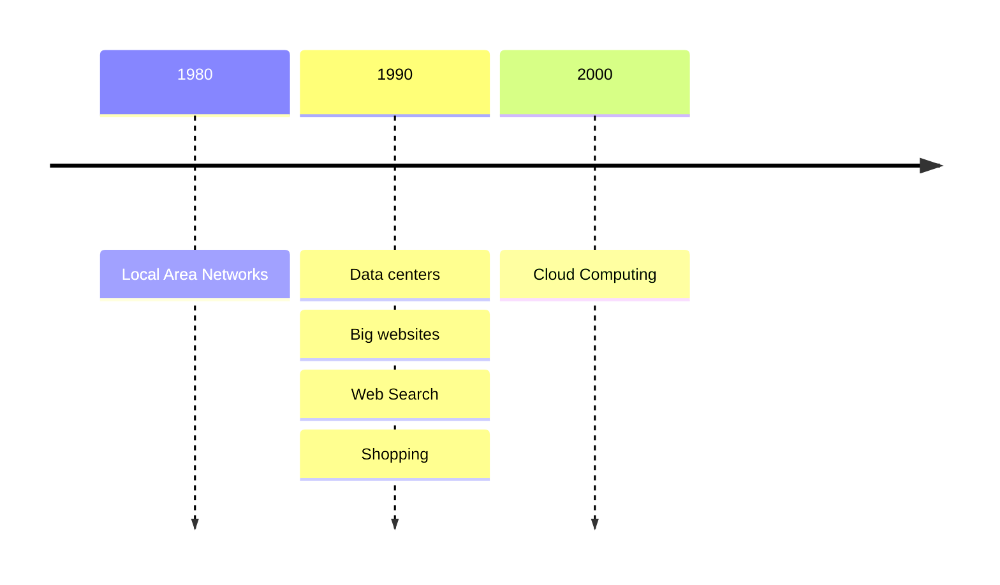

# 6.824 Introduction
### 6.824 分布式系統簡介

---
transition: slide-left
---

# What is **Distributed Systems** <carbon-network-4/>?

簡單講就是一群電腦透過網路串連再一起協同工作.

---
transition: slide-up
layout: default
---

# **Why**?
主要有4個要點:

    

        
連接分散在各地的電腦 &nbsp; <fxemoji-threenetworkedcomputers/>

        <ul>
            <li class="text-sm">達成"分享"</li>
            <li class="text-sm p-2">比如檔案分享, 直播串流等等</li>
        </ul>
    

    

        
增加處理能力, 算力 &nbsp; <uil-processor/>

        <ul>
            <li class="text-sm p-2">多台電腦並行處理(Parallelism), 分擔工作量, 提高效率</li>
        </ul>
    

    

        
故障容許度提升 &nbsp; <material-symbols-broken-image/>

        <ul>
            <li class="text-sm p-2">不會因為一台伺服器故障導致服務中斷</li>
            <li class="text-sm p-2">工作量會由系統裡其他伺服器接手</li>
        </ul>
    

    

        
提升系統安全性 &nbsp; <carbon-security/>

    

---
transition: slide-left
---

# **Why** ?
### some history context

---
transition: slide-down
---

# Challenges

<ol>
    <li>高併發</li>
    <ul class="pl-10">
        <li>排查問題難度上升</li>
    </ul>
    <li>部分失效</li>
    <ul class="pl-10">
        <li>比如: 某幾區的伺服器掛掉但其他地區的正常</li>
        <li>server本身沒問題, 但network掛了</li>
    </ul>
</ol>

---
transition: slide-left
---

# Focus: 重點架構

- Storage 存儲
- Computation 邏輯運算
- Communication 通訊交流
    - RPC, gRPC...

---
transition: slide-up
---

# Main Topics 重點主題

- Fault Tolerance 故障容許度
    - availablity 可用性 ==> 透過replication實現
    - recoverability 回復性 ==> 透過logging/transactions以及durable storage實現
- Consistency 一致性
- Performance 效能
    - throughput 流量
    - latency 延遲

---
transition: fade-out
background: https://source.unsplash.com/collection/94734566/1920x1080
class: text-center
layout: cover
---

# MapReduce

---
transition: slide-left
---

# Context
由Google的兩位工程師發表: Jeffrey Dean && Sanjay Ghemawat

要解決的問題: 將網路裡的 *所有* 網站生成index (web indexing), 方便用戶透過搜尋引擎快速查詢到想要的資料

想達成的目標: 簡單的介面讓非專業的分布式系統工程師, 也能輕鬆實現分佈式架構.

手段: 

- 將自定義的 `map()`, `reduce()` 傳進MapReduce框架裡, 框架會自行將輸入參數分佈到系統內所有機器上.
