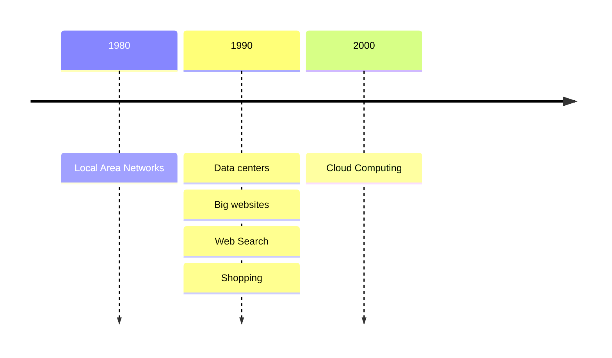

# 6.824 Introduction
### 6.824 分布式系統簡介


---
transition: slide-up
---

# Index

- brief introduction: what is distributed systems?
- what's in the videos?
- introduction: what's MapReduce?
- golang exercise: crawler.go

---
transition: slide-left
---

# What is **Distributed Systems** <carbon-network-4/>?

簡單講就是一群電腦透過網路串連再一起協同工作.


---
transition: slide-up
layout: default
---

# **Why**?
主要有4個要點:

<div style="display: flex; justify-content: space-evenly;">
    <div>
        <div class="text-xl p-2 w-100">連接分散在各地的電腦 &nbsp; <fxemoji-threenetworkedcomputers/></div>
        <ul>
            <li class="text-sm">達成"分享"</li>
            <li class="text-sm p-2">比如檔案分享, 直播串流等等</li>
        </ul>
    </div>
    <div>
        <div class="text-xl p-2 w-100">增加處理能力, 算力 &nbsp; <uil-processor/></div>
        <ul>
            <li class="text-sm p-2">多台電腦並行處理(Parallelism), 分擔工作量, 提高效率</li>
        </ul>
    </div>
</div>

<div style="display: flex; justify-content: space-evenly;" class="mt-30">
    <div>
        <div class="text-xl p-2 w-100">故障容許度提升 &nbsp; <material-symbols-broken-image/></div>
        <ul>
            <li class="text-sm p-2">不會因為一台伺服器故障導致服務中斷</li>
            <li class="text-sm p-2">工作量會由系統裡其他伺服器接手</li>
        </ul>
    </div>
    <div>
        <div class="text-xl p-2 w-100">提升系統安全性 &nbsp; <carbon-security/></div>
    </div>
</div>

---
transition: slide-left
---

# Focus: 分布式系統需要注意的三個部分...

- Storage 存儲
- Computation 邏輯運算
- Communication 通訊交流
    - RPC, gRPC...

---
transition: slide-up
---

# Main Topics 重點主題

- Fault Tolerance 故障容許度
    - availablity 可用性 ==> 透過replication實現
    - recoverability 回復性 ==> 透過logging/transactions以及durable storage實現
- Consistency 一致性
- Performance 效能
    - throughput 流量
    - latency 延遲

---
transition: slide-left
---

# **Why** ?
### some history context

<div class="-m-4 w-3/4">

</div>

---
transition: slide-down
---

# Challenges

<ol>
    <li>高併發</li>
    <ul class="pl-10">
        <li>排查問題難度上升</li>
    </ul>
    <li>部分失效</li>
    <ul class="pl-10">
        <li>比如: 某幾區的伺服器掛掉但其他地區的正常</li>
        <li>server本身沒問題, 但network掛了</li>
    </ul>
</ol>

---
transition: fade-out
background: https://source.unsplash.com/collection/94734566/1920x1080
class: text-center
layout: cover
---

# MapReduce

---
transition: slide-left
---

# A programming model 開發模型


---
transition: slide-down
---

# Map
- 將輸入參數轉化成KeyValue
- 產出暫存檔存在本機
- 會由很多台機器同時執行不同等分的Map function

# Reduce
- 利用RPC呼叫remote端收集Map的產出
- 執行Reduce function統合結果

---
transition: fade-out
layout: two-cols
---


::right::
- input => 票
- Map => 將票轉化成KeyValue: xxx候選人, 1
- Reduce => 將Map的結果收集, 比如

```ts
// Map
[
    {xxx, 1},
    {yyy, 1},
    {xxx, 1},
    {zzz, 1},
    {yyy, 1},
    {aaa, 1},
    ...
]
================>
// Reduce
[
    "xxx": 2,
    "yyy": 2,
    "zzz": 1,
    "aaa": 1,
    ...
]

```

---
transition: slide-left
---


---
transition: fade-out
layout: two-cols
---


::right::


---
transition: fade-out
---


---
background: https://source.unsplash.com/collection/94734566/1920x1080
transition: fade-out
class: text-center
layout: cover
---

# crawler.go

--- 
transition: fade-out
class: text-center
layout: cover
---

# RPC: Remote Procedure Call

### 分布式系統溝通方式

---
transition: slide-left
---

## Calling a *function* over a network
1. Client calls stub function
2. stub sends message to server (client then waits for response)
3. Server decodes stub message
4. Server runs desinated function
5. functions returns values and stub marshalls the value
6. send back to client


---
transition: slide-left
---

# **Why** use RPC?

- 相對簡單: 只需要知道function名稱及相關參數, 剩下的讓RPC處理
- **高效**: 比如說gRPC使用HTTP/2協定, REST則是HTTP/1.1
- **高效2**: 可選擇使用更小體積的protocol buffer, REST則通常是JSON, XML
- **高效3**: 支援雙向streaming, REST則是request-response

### 延伸閱讀

- https://medium.com/@vasu.pal/rpc-vs-rest-demystifying-web-api-aa5527a87483
- https://blog.dreamfactory.com/grpc-vs-rest-how-does-grpc-compare-with-traditional-rest-apis/#:~:text=%E2%80%9CgRPC%20is%20roughly%207%20times,HTTP%2F2%20by%20gRPC.%E2%80%9D

---
transition: slide-up
---


